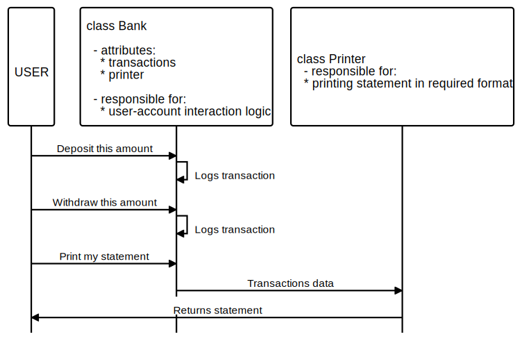

# BankTechTestRuby
Ruby repo for Makers Week 10 individual tech test

## What does this code do?
Emulates a banking system. Users can interact in IRB to perform the following tasks on an account:
  - make deposits
  - make withdrawals
  - print statement    
For more details and acceptance criteria, see [original specification requirements](https://github.com/makersacademy/course/blob/main/individual_challenges/bank_tech_test.md).

### Edgecases / Additional scenarios  
I encountered edgecases and scenario considerations which were not covered by the original requirements. I have made the following decisions while designing and building this code. In a real tech test, I would seek some expected outputs and behaviour from the client to guide these decisions. 

Scenario | Intended code behaviour
---------|------------------------
Withdrawal amount is greater than current balance | Allow account to become overdrawn (i.e. balance can be negative)
Requirements do not specify whether transaction date should be input by user or auto-generated | User to supply transaction date. However, this relies on a compliant user. Code to implement an auto-generated date is WIP on branch "Calendar" of this repo.
A bank might reasonably have many accounts, and a user might have many accounts at the same bank | The user must specify the account (i.e. user must know their account_id) in order to perform transactions
User provides an incorrect account_id that is not present | Throw an error
User provides an incorrect account_id that happens to exist | Transaction will proceed - this incurs the risk that users can make transactions on the wrong account through human error. If this is a concern, code could be changed to require a password or other verification before allowing access to an account.

## Planned domain interaction model



## Setup
1. Clone this repo by typing/copying this code snippet into your terminal:   
`git clone https://github.com/BecaLParker/BankTechTestRuby.git`

2. Navigate to relevant directory: 
 `cd BankTechTestRuby`
 
3. Install dependencies from gemfile:
`bundle`

### How to run my tests
Run RSPEC  
`rspec`


### How to interact as a user
1. First load the code to IRB : `irb -r './lib/bank.rb'`  
2. Create at least one account : `account = Account.new`, and take note of the `@account_id` from the returned object (you will need this to run transactions on the account)  
> In a real-life scenario, assume the user would have an existing account and know the account_id number.  
1. Then initialize the bank object, passing it an array containing the account object/s you've made: `bank = Bank.new([account])`

- To make a deposit:  
`bank.deposit(1000, "06/07/2020", 10.00)`  (where 1000 is the account_id, followed by date as a string, followed by the amount to deposit) 


- To make a withdrawal:  
`bank.withdraw(1000, "06/07/2020", 10.00)`  (where 1000 is the account_id, followed by date as a string, followed by the amount to withdraw)


- To print account statement:  
`bank.print_statement(1000)` (where 1000 is the account_id)  
=> date || credit || debit || balance  
=> 

## Aims
This task is about producing the best code I can when there is a minimal time pressure.
 - practice my OO design and TDD skills.
 - working independently 
 - practice reflecting on and improving my own work.

## Original Makers Specification:

### Requirements

* You should be able to interact with your code via a REPL like IRB or the JavaScript console.  (You don't need to implement a command line interface that takes input from STDIN.)
* Deposits, withdrawal.
* Account statement (date, amount, balance) printing.
* Data can be kept in memory (it doesn't need to be stored to a database or anything).

### Acceptance criteria

**Given** a client makes a deposit of 1000 on 10-01-2012  
**And** a deposit of 2000 on 13-01-2012  
**And** a withdrawal of 500 on 14-01-2012  
**When** she prints her bank statement  
**Then** she would see

```
date || credit || debit || balance
14/01/2012 || || 500.00 || 2500.00
13/01/2012 || 2000.00 || || 3000.00
10/01/2012 || 1000.00 || || 1000.00
```

## Self-assessment

Once you have completed the challenge and feel happy with your solution, here's a form to help you reflect on the quality of your code: https://docs.google.com/forms/d/1Q-NnqVObbGLDHxlvbUfeAC7yBCf3eCjTmz6GOqC9Aeo/edit
